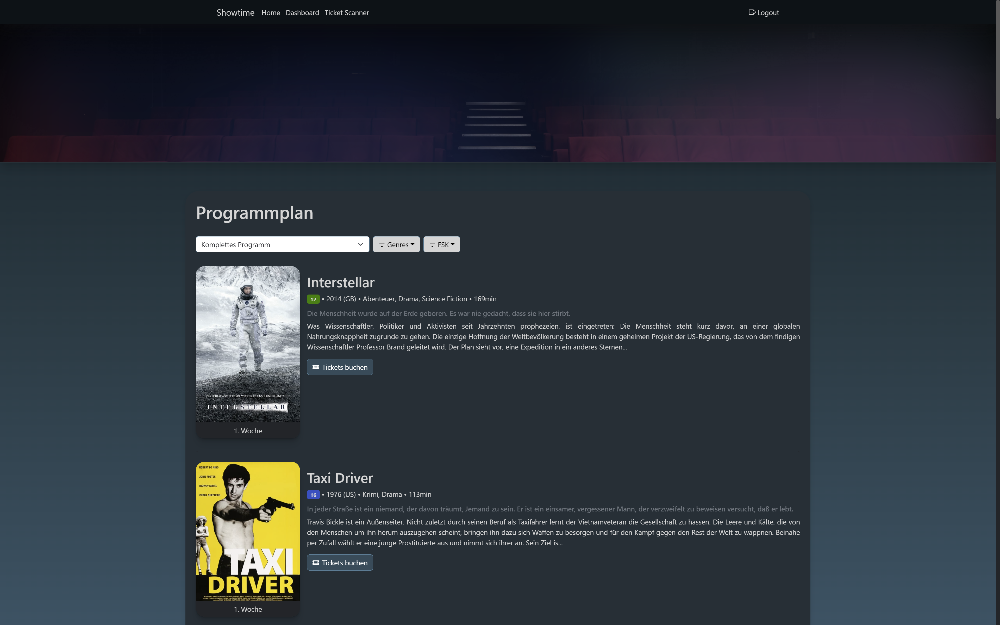
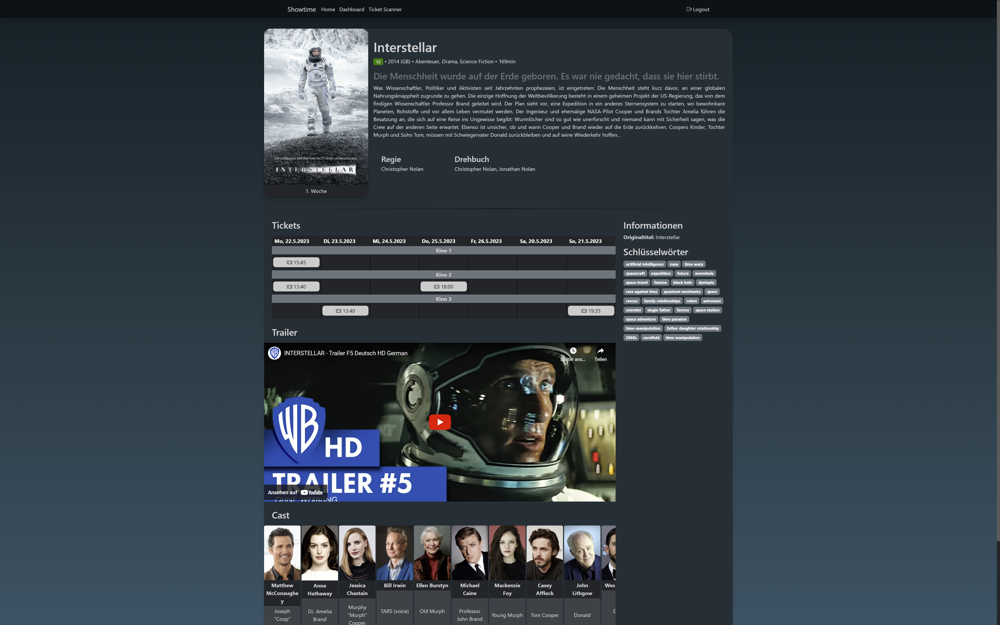
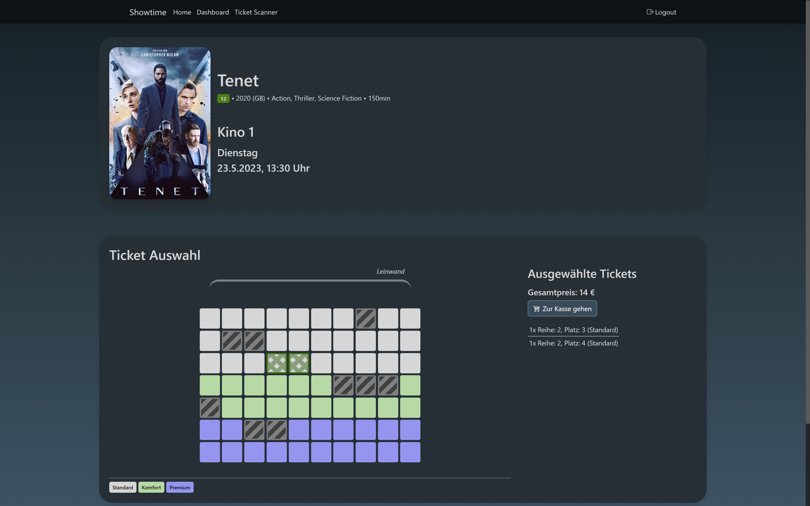
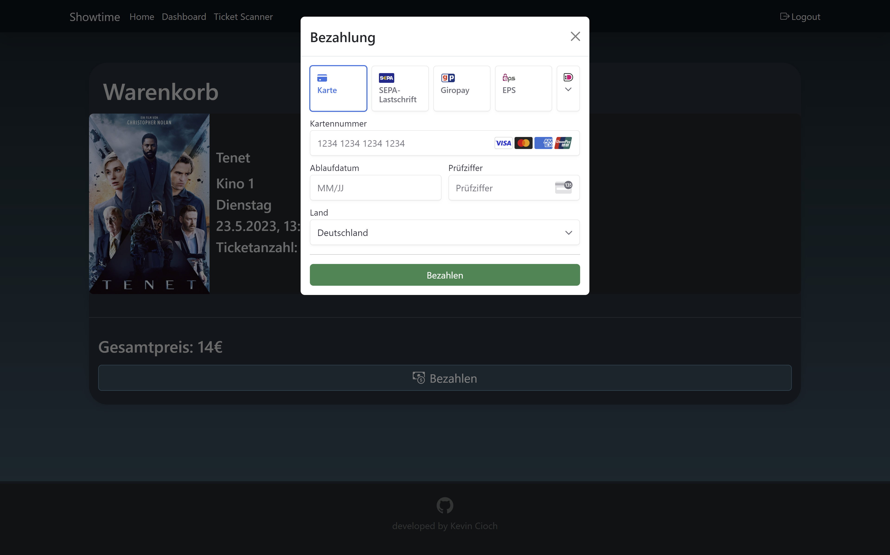
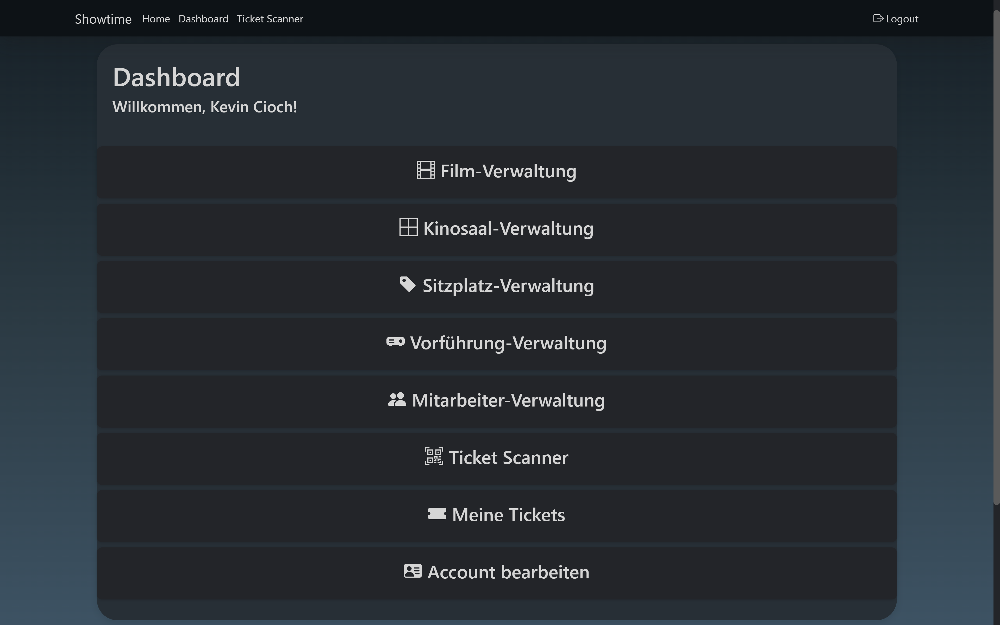
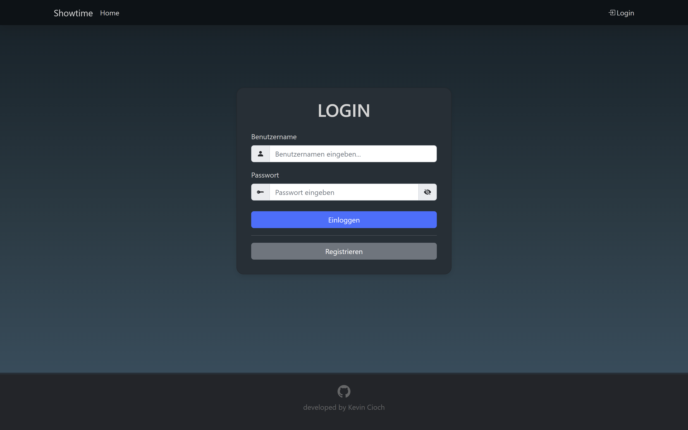
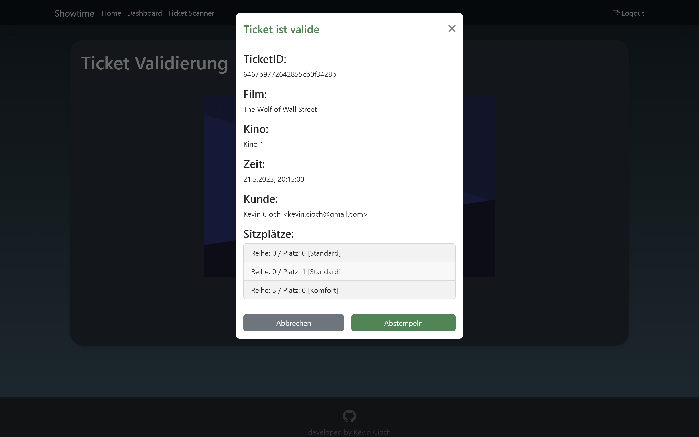
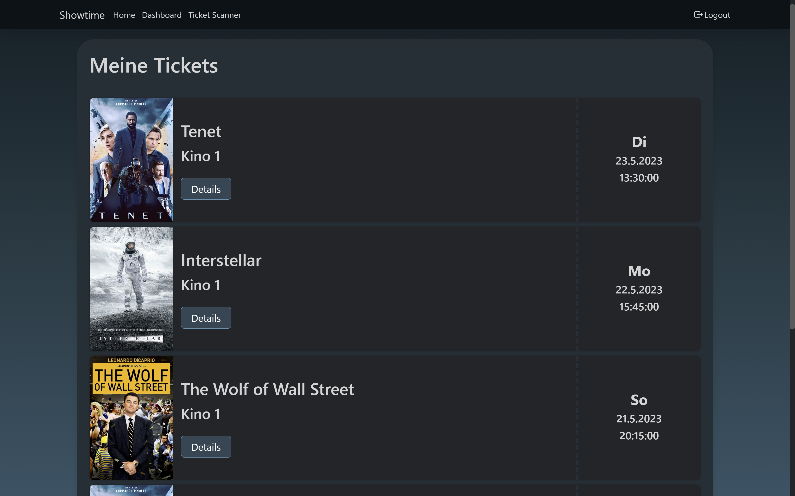
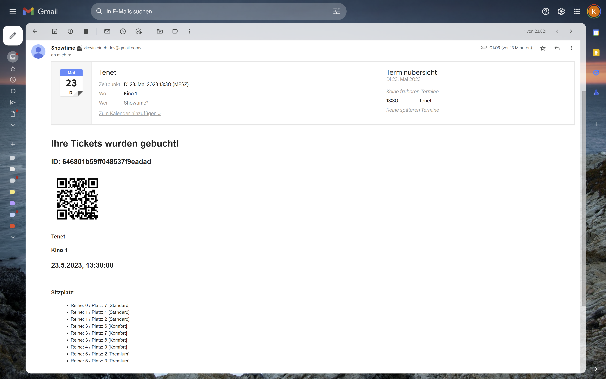

<h1 align="center">
  Showtime!
  <p style="font-style: italic ">the online tool for cinema operators</p>
  <p>🎞 • 🎫 • 🎬 • 🎥</p>
</h1>

`Showtime` is a web application designed for cinema operators, providing them with a centralized platform for managing their movie schedules and ticketing. Its core functionalities include an online program plan, ticket booking, seat selection, ticket validation, and user account management with authentication capabilities. With Showtime, cinema owners can efficiently organize their movie screenings, allow customers to book tickets seamlessly, manage seating arrangements, and validate tickets during screenings. This comprehensive solution streamlines the cinema operation process and enhances the overall movie-going experience.

# Live Demo

You can see the application in action by checking out the [live demo](https://showtime-cinema.vercel.app).

To try out the payment process you can use a payment method that redirects to a demo page to approve or disapprove the payment like Giropay or use the following demo credit card:

> <b>CARD-NR.:</b> 4242 4242 4242 4242
> <br /><b>EXPIRY DATE:</b> use a future date
> <br /><b>CHECK DIGIT:</b> 424

# Screenshots

<div align="center" style="display: flex; justify-content: center; flex-wrap: wrap; gap: 2em">
  
  
  
  
  
  
  
  
  
</div >

# Features

## Basic

- Authentication (JWT)
- Login & register
- Edit account information
- Responsive design

## Customer

- Filter program plan
- Movie details
- Seat selection
- Ticket booking and payment process
- Ticket overview
- E-Mail confirmation with QR-Code and iCal event

## Admin

- Manage cinemas with a cinema editor
- Manage seattypes and their prices
- Manage movies
- Screeningplan editor
- Manage staff accounts

## Staff

- Validate tickets with a QR-Code scanner

# Requirements

- NodeJS
- MongoDB Database
- TMDB API Key [(register here)](https://www.themoviedb.org/signup)
- Stripe API Key [(register here)](https://dashboard.stripe.com/register)

# Setup

To setup the project follow the the next steps. It's important to create an `.env` file based on the required environment variables in `.env.sample` before running the application.

```bash
# 1. Clone repository
$ git clone https://github.com/kecioch/showtime
```

## Frontend

```bash
# 2.1 Navigate into repository
$ cd frontend

# 2.2 Install dependencies
$ npm i --force

# 2.3 Rename .env.sample to .env file and fill out the environment variables

# 2.4 Start frontend
$ npm run start
```

> **_NOTE_**: Because the frontend uses version 3.0.0 of the react-qr-reader package which doesn't support react 18.2 officially at the moment, you need to use the _--force_ paramter to install the packages.

## Backend

```bash
# 3.1 Navigate into repository
$ cd ../backend

# 3.2 Install dependencies
$ npm i

# 3.3 Rename .env.sample to .env file and fill out the environment variables

# 3.4 Start backend api
$ npm run start
```

# Technologies

- [React](https://reactjs.org/)
- [Bootstrap](https://getbootstrap.com/)
- [React-Bootstrap](https://react-bootstrap.github.io/)
- [Express](https://expressjs.com/de/)
- [JWT](https://jwt.io/)

# APIs

- [Stripe](https://stripe.com/)
- [TMDB](https://www.themoviedb.org/)
